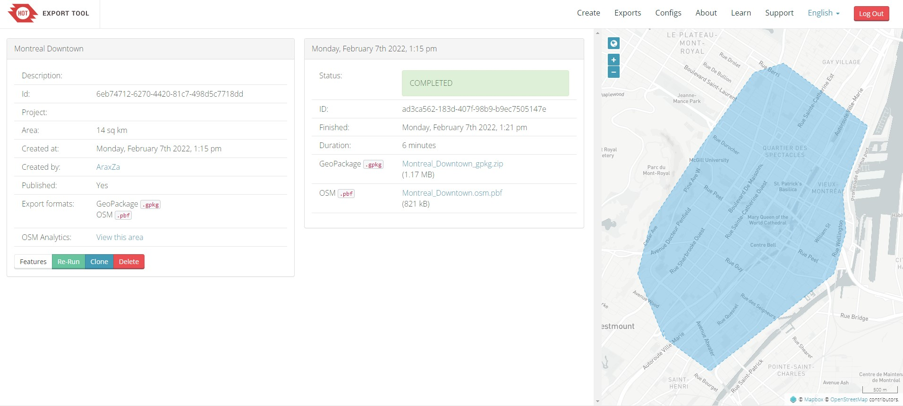

# **Setup SUMO Simulation**

This is a walkthrough document on how to use the SUMO simulation engine to simulate traffic on a specific region and study the traffic behaviors using TraCI.

## **Prepare Map**

**Export Map**
You can export the map from OpenStreetMap. But, because I want to have a very specific region of the city, I used [HotOSM](https://export.hotosm.org/) to draw my desired region and export. This is a free service, but you need to create an account on their website. Specify your desired region and set the required attributes and then export as `.pbf` format.


**Convert .pbf to .osm**

`osmconvert` is an applicaiton to convert the different map types. You can download the app from [here](https://wiki.openstreetmap.org/wiki/Osmconvert#Binaries)

> osmconvert 0.8.8
>
> Converts .osm, .o5m, .pbf, .osc, .osh files, applies changes
> of .osc, .o5c, .osh files and sets limiting borders.

**Note: Underscores are not supported in the file names.**

```sh
osmconvert <PATH_TO_PBF_FILE>.pbf --out-osm -o=<PATH_TO_OUTPUT_FILE>.osm
```

**Convert OSM to NETWORK**

```sh
netconvert --osm-files <PATH_TO_OSM_FILE> --output-file <PATH_TO_NETWORK_FILE>.net.xml --geometry.remove --roundabouts.guess --ramps.guess --junctions.join --tls.guess-signals --tls.discard-simple --tls.join
```

The following command creates a configuration based on the provided inputs. If you don't want to save the configuraion and want to run the command right away, remove the `--save-configuration`.

```sh
netconvert --save-configuration netconvert-configuration.xml --osm-files concordia-sgw-region.osm --output-prefix TIME --output-file concordia-sgw-region.net.xml --output.street-names --output.original-names --proj.plain-geo --plain.extend-edge-shape --geometry.remove --roundabouts.guess --ramps.guess --junctions.join --tls.guess-signals --tls.discard-simple --tls.join --crossings.guess --osm.lane-access --osm.all-attributes --osm.extra-attributes all --ignore-errors --error-log logs.txt
```

Then, you can use run the `netconvert` command using the saved configuration:

```sh
netconvert -c .\netconvert-configuration.xml
```

**Additional Polygons (Building, Water, etc.)**

To show other ploygons on the network, we need to have an additional file to define these objects. The following file should be created as a name such as `osmPolyconvert.typ.xml`. The save this file beside your network. Then we will be adding this file to our configuration in next steps:

```xml
<polygonTypes>
  <polygonType id="waterway"                name="water"       color=".71,.82,.82" layer="-4"/>
  <polygonType id="natural"                 name="natural"     color=".55,.77,.42" layer="-4"/>
  <polygonType id="natural.water"           name="water"       color=".71,.82,.82" layer="-4"/>
  <polygonType id="natural.wetland"         name="water"       color=".71,.82,.82" layer="-4"/>
  <polygonType id="natural.wood"            name="forest"      color=".55,.77,.42" layer="-4"/>
  <polygonType id="natural.land"            name="land"        color=".98,.87,.46" layer="-4"/>

  <polygonType id="landuse"                 name="landuse"     color=".76,.76,.51" layer="-3"/>
  <polygonType id="landuse.forest"          name="forest"      color=".55,.77,.42" layer="-3"/>
  <polygonType id="landuse.park"            name="park"        color=".81,.96,.79" layer="-3"/>
  <polygonType id="landuse.residential"     name="residential" color=".92,.92,.89" layer="-3"/>
  <polygonType id="landuse.commercial"      name="commercial"  color=".82,.82,.80" layer="-3"/>
  <polygonType id="landuse.industrial"      name="industrial"  color=".82,.82,.80" layer="-3"/>
  <polygonType id="landuse.military"        name="military"    color=".60,.60,.36" layer="-3"/>
  <polygonType id="landuse.farm"            name="farm"        color=".95,.95,.80" layer="-3"/>
  <polygonType id="landuse.greenfield"      name="farm"        color=".95,.95,.80" layer="-3"/>
  <polygonType id="landuse.village_green"   name="farm"        color=".95,.95,.80" layer="-3"/>

  <polygonType id="tourism"                 name="tourism"     color=".81,.96,.79" layer="-2"/>
  <polygonType id="military"                name="military"    color=".60,.60,.36" layer="-2"/>
  <polygonType id="sport"                   name="sport"       color=".31,.90,.49" layer="-2"/>
  <polygonType id="leisure"                 name="leisure"     color=".81,.96,.79" layer="-2"/>
  <polygonType id="leisure.park"            name="tourism"     color=".81,.96,.79" layer="-2"/>
  <polygonType id="aeroway"                 name="aeroway"     color=".50,.50,.50" layer="-2"/>
  <polygonType id="aerialway"               name="aerialway"   color=".20,.20,.20" layer="-2"/>

  <polygonType id="shop"                    name="shop"        color=".93,.78,1.0" layer="-1"/>
  <polygonType id="historic"                name="historic"    color=".50,1.0,.50" layer="-1"/>
  <polygonType id="man_made"                name="building"    color="1.0,.90,.90" layer="-1"/>
  <polygonType id="building"                name="building"    color="1.0,.90,.90" layer="-1"/>
  <polygonType id="amenity"                 name="amenity"     color=".93,.78,.78" layer="-1"/>
  <polygonType id="amenity.parking"         name="parking"     color=".72,.72,.70" layer="-1"/>
  <polygonType id="power"                   name="power"       color=".10,.10,.30" layer="-1" discard="true"/>
  <polygonType id="highway"                 name="highway"     color=".10,.10,.10" layer="-1" discard="true"/>
  <polygonType id="railway"                 name="railway"     color=".10,.10,.10" layer="-1" discard="true"/>

  <polygonType id="boundary" name="boundary"    color="1.0,.33,.33" layer="0" fill="false" discard="true"/>
  <polygonType id="admin_level" name="admin_level"    color="1.0,.33,.33" layer="0" fill="false" discard="true"/>
</polygonTypes>
```

Using the following command, we can create a polygon file that contains polygons of our network. SUMO needs this file to show the polygons of your network:

```sh
polyconvert --net-file concordia_sgw_region.net.xml --osm-files concordia_sgw_region.osm --type-file osmPolyconvert.typ.xml -o concordia_sgw_region.poly.xml --osm.keep-full-type
```

After creating the polygon file, you should add `additional` element to the sumo config file, pointing to the polygons file:

```xml
 <configuration>
     <input>
         <net-file value="montreal_3.net.xml"/>
         <additional-files value="montreal_downtown.poly.xml"/>
     </input>
 </configuration>
```

## **Prepare Traffic**

It is important to understand the difference of `trips` and `routes` in SUMO. `trips` define origin and destination of each vehicle. But, these files are not enough to move the cars on the simulation map. SUMO needs `routes` for each vehicle. `routes` define the edges that the vehicle should pass to reach the destination. So, we need to have `trips` and `routes` to perform the simulation.

To generate random traffic, I am using `randomtrips.py` which is incldued in SUMO installation package.

```sh
python .\randomTrips.py -n .\downtown\montreal_3.net.xml -e 500 -o .\downtown\flows.xml --flows 100 --jtrrouter --trip-attributes 'departPos="random" departSpeed="max"'
```

The following command generate routes file:

```sh
python .\randomTrips.py -n .\downtown\montreal_3.net.xml -e 500 -r .\downtown\random_rou.xml -l --validate
```

And this command generates trips file with randomly distributed departure time:

```sh
python .\randomTrips.py -n .\inputs\2022-03-01-13-07-21downtown_montreal_4.net.xml -e 500 -o .\inputs\random_trips_2.xml -l --validate -p 0.2 --binomial 10
```

This is the command if you would like to generate the routes on your own effort.

```sh
duarouter -n .\montreal_downtown_2.net.xml -r montreal_trips_2.trip.xml --ignore-errors --begin 0 --end 10000 --no-step-log --no-warnings -o montreal_routes_2.rou.xml
```

## **Prepare Configuration**

SUMO needs a configuration file to run the simulation. This configuration tells SUMO where it can find the map (network) and routes. The configuration file should be saved as `NAME.sumocfg`. Here is a sample of this file:

```xml
<configuration>
    <input>
        <net-file value="./downtown/montreal_downtown_2.net.xml" />
        <route-files value="./downtown/montreal_routes_2.rou.xml" />
    </input>
</configuration>
```

## **Run Simulation**

The current desgin consists of 3 primary scripts:

- Server Initializer: Loads simulation configurations and starts the server
- Client: connects to the running server and applies any probable changes to the engine
- Change Receiver: stores requested changes from user input

To run this version, I am using Python `subprocess` ro run the scripts in parallel. To run the simulation, simply run this command:

```sh
python sumo_manager.py `
-c downtown.sumocfg `
--net ./map_conversion/2022-03-01-13-07-21downtown_montreal_4.net.xml `
--schedule sample_schedule.csv `
--output tripinfo.xml
```

To chnage vehicle destination you can use the following command. You can simply specify the vehicle id and destination address in this command:

```sh
python components/reroute.py --vehicle on_demand_vehicle_0 --address "2090 tupper montreal"
```

## **Get Simulation Data**

When the simulation is running, we can get various properties from the engine. Like, vehicles, pedestrian, traffic signals, etc. Also, it is possible to apply changes to the elements that exist in the simulation and are running in the map. Such as changing destinations, rerouting, adding vehicles, stopping vehicles, etc.

## **Proposed Script**

I will be creating a python script to does all of the preparations and start the sumo, finally generates an output for the user:

```sh
python simulate.py \
    --map montreal.osm \
    --schedule plan.csv \
    --output tripsinfo.xml \
    --gui
```

**Ideas:**

- Containerize SUMO then connect using TraCI.
- Deploy SUMO container into cloud and access with web.

**Auto-Rerouting:**
Use this feature for vehicles to enable them to reroute if there is a traffic jam.

- [Auto-Reroute](https://sumo.dlr.de/docs/Demand/Automatic_Routing.html)

**Stops:**
We can use `stop` element for vehicles and routes. It is possible to set the duration and if the vehicle should go to a parking while waiting (It causes not to block the street while waiting).
[Stops](https://sumo.dlr.de/docs/Definition_of_Vehicles%2C_Vehicle_Types%2C_and_Routes.html#stops)

## **Resources**

- [SUMO](https://sumo.dlr.de/docs/sumo.html)
- [TraCI Python Interface](https://sumo.dlr.de/docs/TraCI/Interfacing_TraCI_from_Python.html)
- [Libsumo](https://sumo.dlr.de/docs/Libsumo.html)
- [V2X](https://sumo.dlr.de/docs/Topics/V2X.html)
- [3D--Unity-Integration](https://github.com/DarraghMac97/Real-time-Traffic-Simulation-with-3D-Visualisation)
- [3D-Unity-Integration-2](https://github.com/BMEAutomatedDrive/SUMO-Unity3D-connection)
- [Pedestrian-Unity](https://github.com/dalugoga/sumo-unity-distributed-pedestrian-simulator)
- [SumoLachineArea](https://github.com/DerekRuiz/SumoLachineArea)
- [Sumolib examples](https://sumo.dlr.de/docs/Tools/Sumolib.html)
- [GPS Traces Dump](https://github.com/iandees/planet-gpx-dump)
